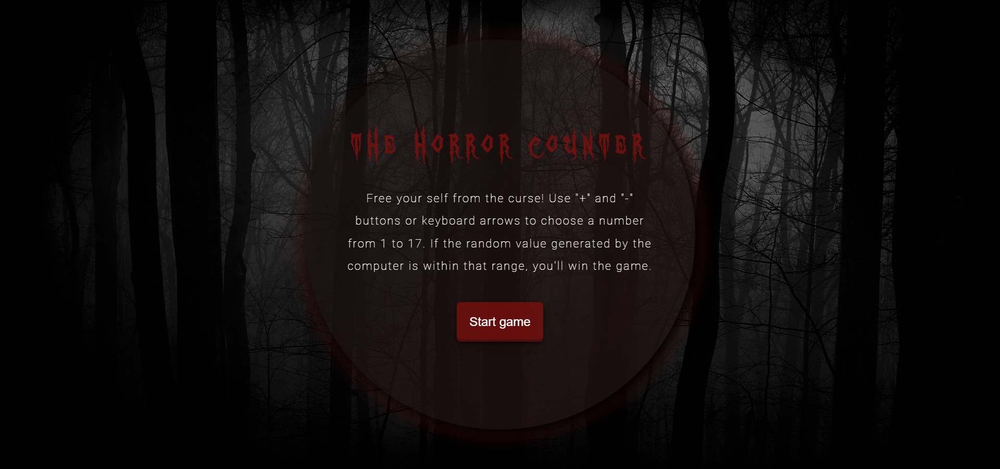
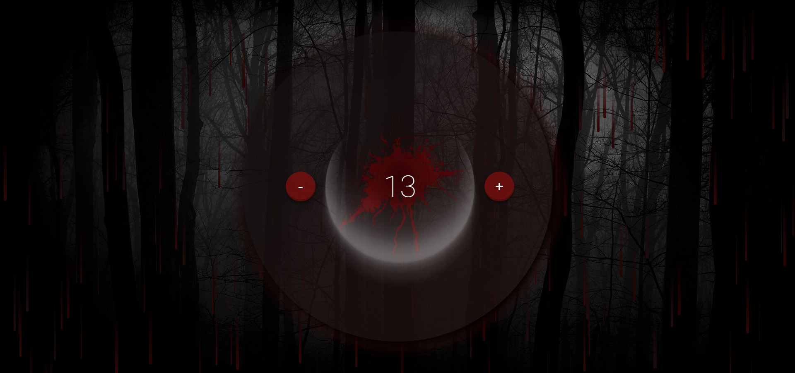
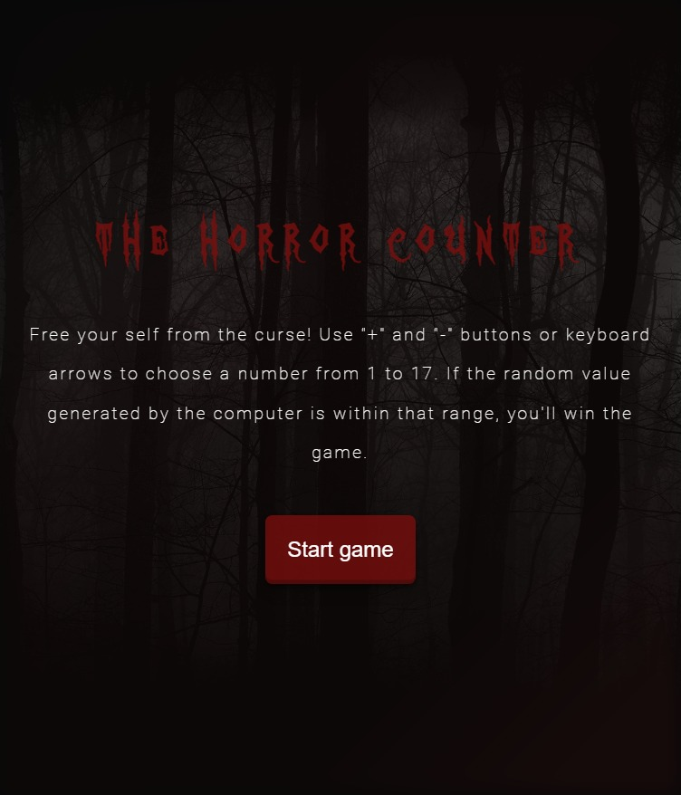
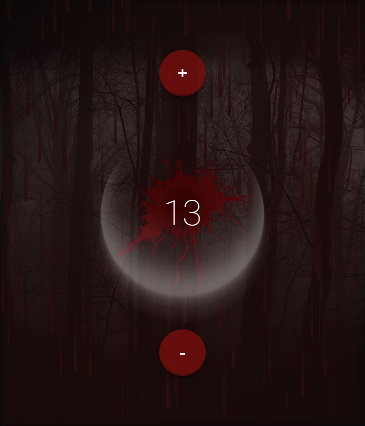
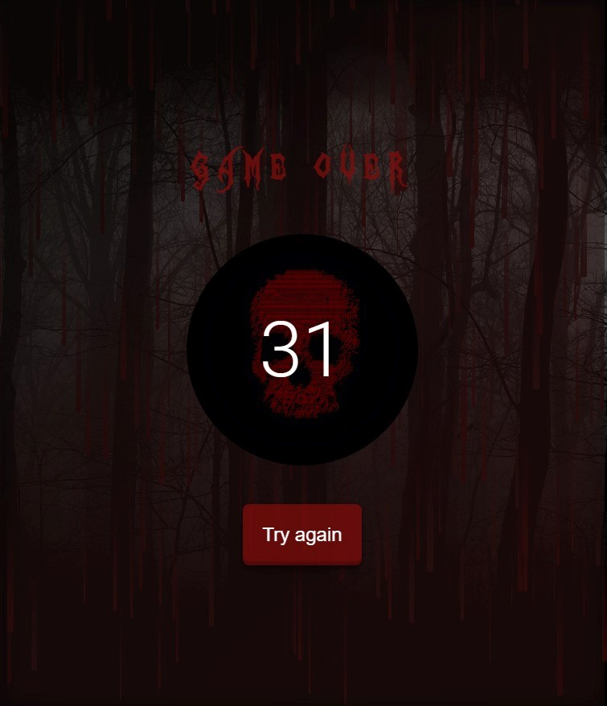
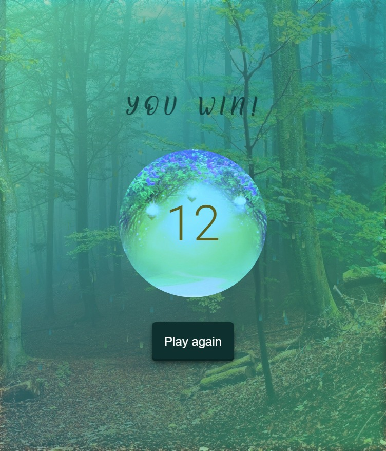

# start2impact - Counter App

start2impact is an online community and platform that offers professionalizing courses in the digital field. This is an overview of the second course project in Web & App Development.

## Table of contents

- [Overview](#overview)
  - [Concept and usage](#concept-usage)
  - [The challenge](#the-challenge)
  - [Screenshots](#screenshots)
  - [How to use](#installation)
  - [Links](#links)
- [My process](#my-process)
  - [Built with](#built-with)

## Overview

### The concept

The creative idea behind this project was to transform a simple counter into a basic horror game.

The user can increment and decrement the counter within a range of integers from 1 to 17.

The computer generates a random number between 1 and 34.
If the computer generated number falls within the range of the counter, the user can win and "break free from the curse". If not, the game over screen will appear.

### The challenge

The challenge was to develop a simple counter with vanilla Javascript using the DOM manipulation features.

### Screenshots

Desktop start game interface:



Desktop counter game interface:



Desktop game-over interface:


Desktop game-win interface:


Mobile start game interface:



Mobile counter game interface:



Mobile game-over interface:



Mobile game-win interface:



### How to use

If you have Git installed on your computer you can clone this repository from your command line typing:

```
$ git clone https://github.com/Auro-93/horror-counter.git
```

You don't need to install any dependencies.

### Links to website application

- Github-Pages URL: [https://auro-93.github.io/horror-counter/]
- Netlify URL: [https://horror-counter.netlify.app/]

## My process

### Built with

- HTML5
- SEO oriented meta-tag
- CSS
- Responsive layout
- Vanilla Javascript
- Animate.css library
